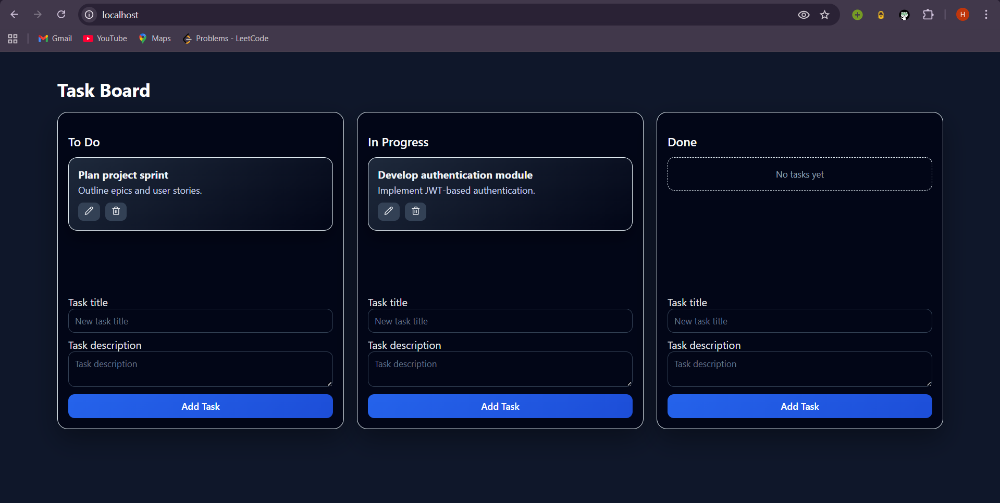
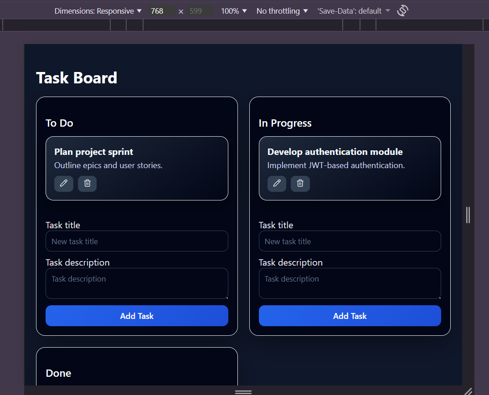
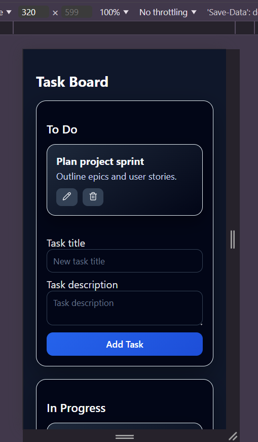

# Interactive Real-Time Task Board with Optimistic UI

A fully responsive Kanban-style task management application built with React and Zustand, demonstrating atomic optimistic UI updates, rollback mechanisms, and robust client-side state management.

This project focuses on perceived performance, resilient state handling, and clean architectural separation of concerns.

---

## Project Overview

This application simulates a real-world task management board similar to Trello, emphasizing:

- Immediate UI feedback using optimistic updates
- Rollback mechanisms for failed API operations
- Atomic state transitions
- Global state management using Zustand
- Mocked backend API with artificial latency and failure simulation
- Production-ready Dockerized deployment

The goal of this project is to demonstrate mastery of modern frontend architecture patterns for highly interactive applications.

---

## Core Features

-  Three task columns: To Do, In Progress, Done
-  Add, edit, delete tasks with optimistic UI updates
-  Drag-and-drop task movement between columns
-  Atomic rollback on simulated API failure
-  Local persistence using localStorage
-  Loading skeleton UI
-  Accessible error notifications
-  Fully responsive layout (Mobile, Tablet, Desktop)
-  Unit & integration tests
-  Dockerized production build

---

## Optimistic UI Strategy

All state mutations follow a strict atomic optimistic pattern:

1. **Immediate UI update** (optimistic state change)
2. **API call dispatched**
3. On success → state is confirmed and persisted
4. On failure → state fully reverts to previous snapshot
5. Error message displayed to user

### Example: Add Task Flow

- Temporary ID generated
- Task inserted immediately into UI
- API request sent
- On success → temporary ID replaced with confirmed ID
- On failure → task removed and UI restored

This ensures:
- Zero UI blocking
- No inconsistent state
- No partial updates
- Clean rollback handling

---

## State Management Approach

The application uses **Zustand** for global state management.

### Why Zustand?

- Lightweight and performant
- Simple API
- Direct snapshot access via `get()` (critical for rollback)
- Clean separation between UI and business logic
- Minimal boilerplate

State structure includes:

- tasks
- columns
- loading
- error

All updates are immutable and atomic.

---

## Atomic Rollback Mechanism

For update and delete operations:

- A snapshot of the previous state is captured using `get()`
- Optimistic mutation is applied
- If API fails → previous snapshot is restored entirely

This guarantees:

- No UI corruption
- No stale partial updates
- Safe concurrent optimistic operations

---

## Local Persistence

Task data is persisted using `localStorage`.

Persistence occurs only after successful API confirmation to prevent corrupt data.

On application load:

- If persisted state exists → load from localStorage
- Otherwise → fetch from mocked API

This ensures:

- No data loss across sessions
- No stale data overwriting

---

## Testing Strategy

The project includes:

### Unit Tests (Zustand Store)

- Optimistic add success
- Add rollback on failure
- Update rollback
- Delete rollback
- Move rollback

### Integration Test

- Verifies optimistic task addition
- Confirms rollback when mocked API fails

Testing stack:
- Vitest
- React Testing Library
- JSDOM

Run tests:

```bash
npm run test
````

---

## Responsive Design

Breakpoints supported:

* Mobile: 375px+
* Tablet: 768px+
* Desktop: 1280px+

Layout uses CSS Grid for column responsiveness.

---

## Accessibility

* Semantic HTML structure
* ARIA roles for alerts
* Keyboard-accessible buttons and forms
* Focus-visible styling
* Reduced motion support
* Passed Lighthouse accessibility audit (no critical issues)

---

## Architecture & Folder Structure

```
src/
  components/
  services/
  store/
  tests/
  styles/
```

Separation of concerns:

* UI components → presentation
* Store → state logic
* services → API simulation
* tests → reliability validation

---

## Docker Setup

### Build and Run

```bash
docker-compose up --build
```

Access the app at:

```
http://localhost
```

### Stop

```bash
docker-compose down
```

---

## Tech Stack

* React (Vite)
* Zustand
* React DnD
* Vitest
* React Testing Library
* Docker + Nginx

---

## Screenshots

### Desktop



### Tablet



### Mobile




---

## Key Takeaways

This project demonstrates:

* Advanced client-side state management
* Atomic optimistic UI updates
* Reliable rollback patterns
* Robust testing practices
* Clean architecture design
* Production-ready deployment workflow
